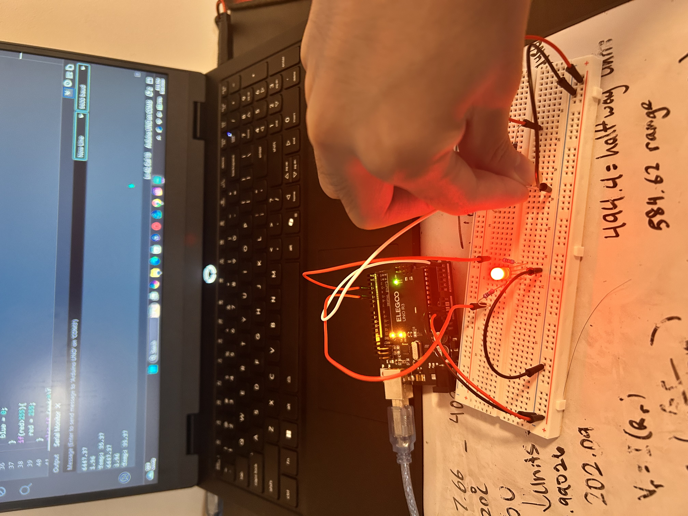
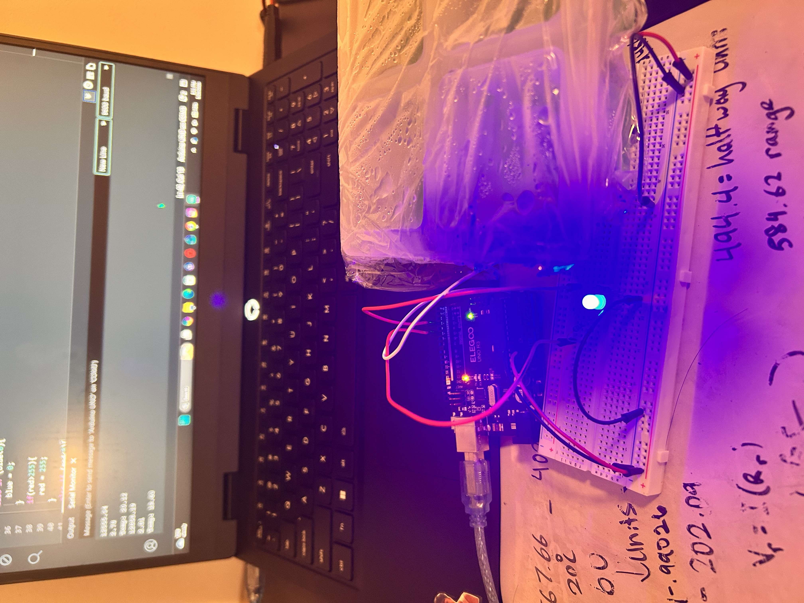
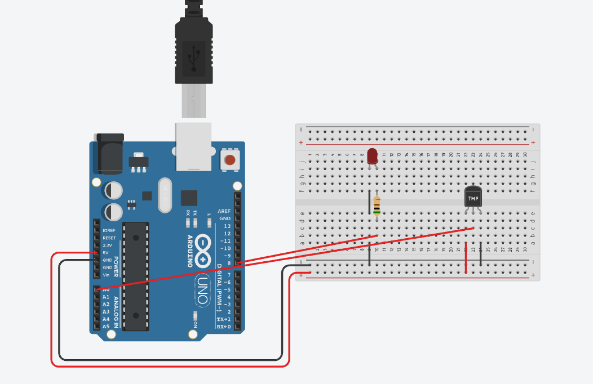

# thermistor-rgb-indicator
First Arduino project based on a RGB LED that changes color depending on the temperature detected by the thermistor. Below is a gif of the color changing transition of the RGB LED. It starts right when I remove the ice, and warms up as I put my finger over it

## How it works
I wanted to make a smart sensor project myself, basically something that takes in data, prints it out, and does something with that data. The project was initially making a red LED blink when crossing a certain temperature threshold, but after completing that I changed it to this. To change the shade of red/blue on the RGB LED, I used a thermistor to detect temperature changes and convert it into resistance. I used SunFounder's official documentation of my specific thermistor to find the formula for it, which is 

$$R_T = R_N \cdot e^{B(\frac{1}{T_K} - \frac{1}{T_N})}$$

And the constants were going to be 10k ohms (RN) at 25 celsius which is 298 kelvin (TN). I also used room temperature of 27C so I can comfortably cross the temperature threshold by just blowing on the thermistor or putting my finger on it. Below is the before and after of putting warming it up with my finger's body temperature and the after of putting a ice mold on it.
 

As for formula derivations, I had to convert temperature in KELVIN, not celsius, into "units", which is what arduino reads. And since the arduino is 10 bits, the max units is 1023, and the max voltage the arduino can output is 5 volts. Meaning each unit is approximately $5/1023 = .0049 volts$. My goal now is to get temperature to voltage conversion. I simply plugged in the temperature threshold I wanted, 302 kelvin, into the $R_T$ formula above as $T_K$. B is the beta constant which is provided in the SunFounder's documentation. The resistance of the thermistor is around 8389.84 ohms at room temperature. I also needed to include one other fixed resistor with a value of 10k ohms to match the $R_N$ constant of the formula and to create a junction for my analogRead() to detect changing voltage. Now, using Ohms Law, I found the current across the system, which will be the same everywhere throughout because I connected my resistor and thermistor in series.

$$V_(total) = IR_(total)$$ 

Then $V_(total)$ will be 5 volts supplied by the arduino, and $R_(total)$ will be the $R_T$ value we found at room temp, which is 8389.84, plus the additional 10k ohm resistor. Now our current is $\frac{5}{18389.84}$ to get $2.72 \cdot 10^{-4}$. Finding the voltage at room temp will be $V_(room) = (current) \cdot (R_T)$ or $V_(room) = (2.72 \cdot 10^{-4}) \cdot (8389.84)$. This is now temperature converted into voltage, and I get 2.28 volts. The conversion from volts to units is just $2.28 / .0049 = 465.53 units$. This is my value for room temp units. 

For the RGB values, I just chose a temperature range, which is between 20C(567.66 units) to 35C(402.08 units) for me so I can see the difference in color easier. I converted it to units using the steps above, and then just converted that range of units to be between 0 to 255 which is the range that RGB values go to. I used the formula 

$$(\frac{x - offset}{range}) \cdot 255$$

where the offset is the value that will bring my x to a value that can just be divisible by the range, and the range is just the difference between my two temperatures. The offset for my range is 402.08 (the smallest value) and the range is 165.58. The red and blue values had to be inverse because if they were the same, it would produce a red or blue dominant color depending on temperature, but it would just produce a brighter or dimmer purple. 

## Debugging
A couple of big important bugs that I ran into:

1) The most notable bug I ran into printed out a temperature of 0 kelvin. It didn't look right since I was at room temperature. But I realized it was because of my datatypes, which was int. It truncated the decimals which were very very important, and just gave me zero. After fixing that, I got a temperature of -55000 kelvin. Based off of my current knowledge of physics and the real world, I assumed that was incorrect and fixed it by changing the 10000 into 10000.00, which was the same decimal truncation problem. I turned everything into a float so that the division wouldn't truncate anything, and got a much more reasonable temperature around 302 kelvin, which is 27C or room temp.

2) When I was doing my first phase which was "making a red LED blink after it goes above room temp", it had the opposite reaction. It blinked below 27C and stayed steady above 27C. I realized that it was because the thermistor didn't behave as I thought it did. Decreasing temperature increases the resistance, while I had thought decreasing temperate decreases the resistance. The relationship was actually inverse. The fix was pretty simple, just reverse the equality signs.

3) I initially didn't think I needed another fixed resistor. I realized I did after looking at the formula for the thermistor, but also because I was confused on where to plug my analogRead() pin. The wire coming from 5v is pinned to 5v and the wire going to ground is pinned to 0v. That is the definition of voltage, the difference between two points. The difference between the two points has to be 5v because that is literally the value supplied by the ardiuno. Inlcuding another resistor satisfies the equation, but also gives me a juntion that has variable voltage that changes according to the change in resistance from the thermistor, and not pinned at 5v or 0v.

4) A simple error of the light just not blinking when I was testing the red LED version, it was because i didn't realize 1 equal sign (=) was different than 2 equal signs(==). One is used for comparison, one changes values.

5) A overflow problem that happened when I pushed the temperature past the limit of what I set of 20C to 35C. I put ice next to the thermistor, and instead of going blue like I'd imagine, it turned vivid blue then jumped into bright red. This was because of a negative value that happens when the temperature goes past my limits, so I used if statements to clamp the range between 0 and 255 for the rgb values.

## Real vs Ideal
Before physically building it, I built it on Tinkercad Circuits. It was infinitely easier because instead of using a thermistor, I had another component called the TMP36. It had a simple linear formula for changing temperature directly into volts, unlike what I had to do by turning temperature into resistance, then into volts. It was also much easier to control the temperature in a simulation. The relationship was also inverse from what I assumed on tinkercad. The thermistor and TMP36 were two very very different components. 

The raw video with serial values is in the media folder, as well as some messy work from my whiteboard that I used as scrap.
